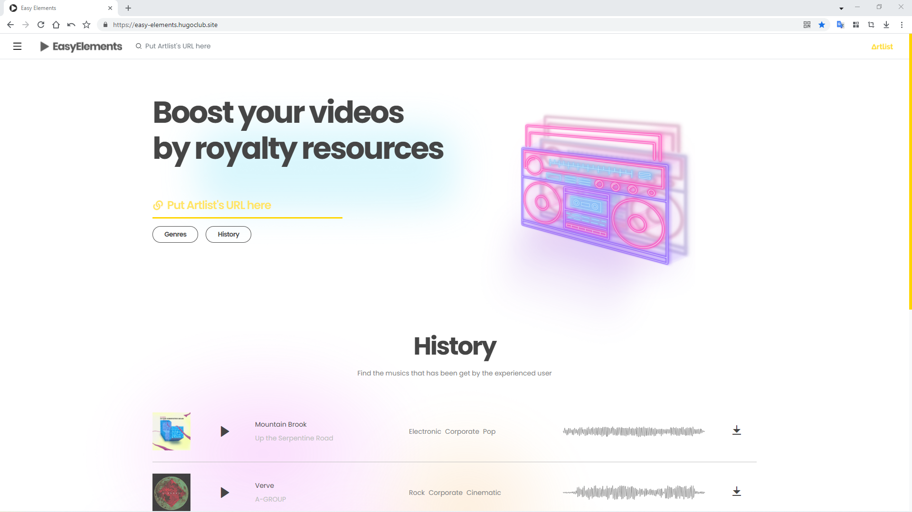
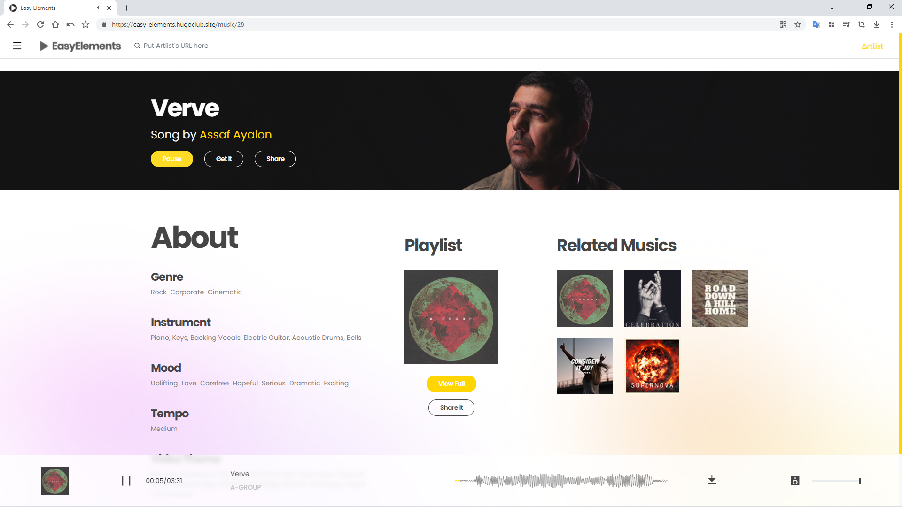

# Easy Elements

This project is used to get elements from [Artlist.io](https://artlist.io/) including Music and SFX.

## How to run this project

This project was bootstrapped with [Create React App](https://github.com/facebook/create-react-app).

You can use these statements provided with **Create React App** to run this project.

## Production app

This project has been builded and deploy to the production environment.

You can try it there:

[https://easy-elements.hugoclub.site/](https://easy-elements.hugoclub.site/)

## Demo

